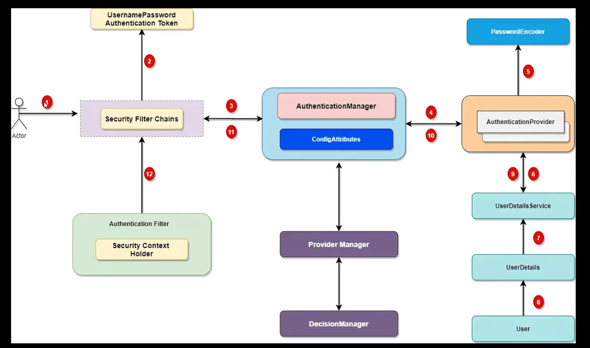

# Cấu hình spring security 
## Lý thuyết về Architecture
## Spring security filter chanins 

`user thực hiện request Security chains -> token -> AuthenticationManager ->....`

add thêm 1 dependency này 

`<!--	Spring Security-->
<dependency>
    <groupId>org.springframework.boot</groupId>
    <artifactId>spring-boot-starter-oauth2-resource-server</artifactId>
</dependency>`